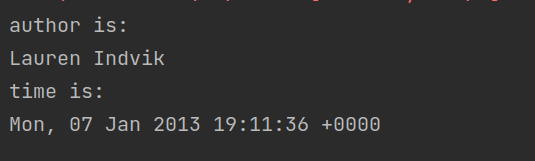
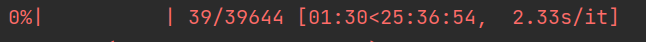

# THU_DM_teamwork1
Code for the news popularity prediction task.


# Data Analysis

- data_channel_is_lifestyle, data_channel_is_entertainment, data_channel_is_bus, data_channel_is_socmed, data_channel_is_tech, data_channel_is_world 其实是一个属性channel，mashable网站把新闻分成了6个channel
- weekday_is_monday, weekday_is_tuesday, weekday_is_wednesday, weekday_is_thursday, weekday_is_friday, weekday_is_saturday, weekday_is_sunday, is_weekend也是一个属性日期，看是星期几

我们将画图分析数据的分布 (TODO)

```
python preprocess.py --task analyse
```


# Preprocess

- 预处理，需要把下载的`OnlineNewsPopularity.csv`放到`./data`下

- 在`./data`下输出 `extra_feature.csv`,` origin_feature.cs` 和 `label.csv`
  - ` extra_feature.csv`是通过爬虫获取的额外特征，包括: author_id,year,month,hour
  - 例如：
  - 爬虫的时间有点慢:
- 原始的 61个属性中, url, timedelta是与热度无关的,去掉

```
python preprocess.py --task preprocess
```


# Model

存放了一个手写的决策树

```python
  #　样例
  X_train = pd.DataFrame({"feature1": [0, 1, 0], "feature2": [1, 1, 0]})
  X_test = pd.DataFrame({"feature1": [0, 1], "feature2": [1, 1]})
  Y_train = pd.DataFrame({"label": [1, 0, 1]})
  # tree_num取1时就是决策树, 取更大就是随机森林
  model = ClassifyModel(tree_num=1)
  model.fit(X_train, Y_train)
  Y_result = model.predict(X_test)
  print("predict is", Y_result)
  # predict is [1, 0]
```

这个决策树有点弱，只能处理类别特征，数值类特征无法处理，请见谅。

# Training

使用了手写完成的决策树分类模型（DT）以及对应机器学习库中的支持向量机（svm）、多层感知机（mlp）、xgboost和k近邻节点（knn）模型，一共五种算法。针对模型的部分可调参数使用了随机搜索算法探索了对应模型的可行最佳超参数取值，对应结果如下表所示

| 模型  | 参数 | Accuracy | AUC_score | F1_score |
| ------------ | ----------- | ----------- | ----------- | ----------- |
| DT      |         |0.50032|0.50023|0.48851|
| MLP     | hidden_layer_sizes=(876,876,512), activation='relu', learning_rate_init=1e-5, max_iter=100,momentum=0.306        |0.64321|0.64287|0.63024|
| SVM     | C=1.0, kernel='rbf'， gamma=0.01        |0.65759|0.65866|0.65672|
| Xgboost | 'n_estimators': 13, 'max_depth': 3, 'learning_rate': 0.1147       |0.65923|0.66129| 0.66617|
| KNN     | n_neighbors=14, weights='uniform'        |0.63564|0.63252|0.59487|
| ResNet  | n_block = 4, d_main = 64, d_hidden = 128, dropout_first = 0.3, dropout_second = 0.0 | 0.66200 | 0.66301 | 0.66067 |
| FT-Transformer  | n_block = 4, d_token = 64, ffn_d_hidden = 128, attention_dropout = 0.2, ffn_dropout = 0.3, residual_dropout = 0.0 | 0.67070 | 0.66949 | 0.65088 |
| ResNet (ensemble)  | n_block = 4, d_main = 64, d_hidden = 128, dropout_first = 0.3, dropout_second = 0.0 | 0.66553 | 0.66626 | 0.66190 |
| FT-Transformer (ensemble) | n_block = 4, d_token = 64, ffn_d_hidden = 128, attention_dropout = 0.2, ffn_dropout = 0.3, residual_dropout = 0.0 | 0.67196 | 0.67053 | 0.65026 |


通过增加额外的信息——作品发布的年月日时间以及作者（id编号），针对上述机器学习模型中性能最好的xgboost额外再次进行了训练和超参数的随机搜索，对应结果如下

| 模型      | 参数 | Accuracy | AUC_score | F1_score |
| ----------- | ----------- | ----------- | ----------- | ----------- |
| Xgboost      | 'n_estimators': 5, 'max_depth': 3, 'learning_rate': 0.1147        |0.66465|0.66523|0.65984|
| ResNet  | n_block = 4, d_main = 64, d_hidden = 128, dropout_first = 0.3, dropout_second = 0.0 | 0.65468 | 0.65703 | 0.66404 |
| FT-Transformer  | n_block = 4, d_token = 64, ffn_d_hidden = 128, attention_dropout = 0.2, ffn_dropout = 0.3, residual_dropout = 0.0 | 0.66906 | 0.66967 | 0.66445 |
| ResNet (ensemble)  | n_block = 4, d_main = 64, d_hidden = 128, dropout_first = 0.3, dropout_second = 0.0 | 0.65985 | 0.66221 | 0.66903 |
| FT-Transformer (ensemble) | n_block = 4, d_token = 64, ffn_d_hidden = 128, attention_dropout = 0.2, ffn_dropout = 0.3, residual_dropout = 0.0 | 0.67196 | 0.67322 | 0.67245 |